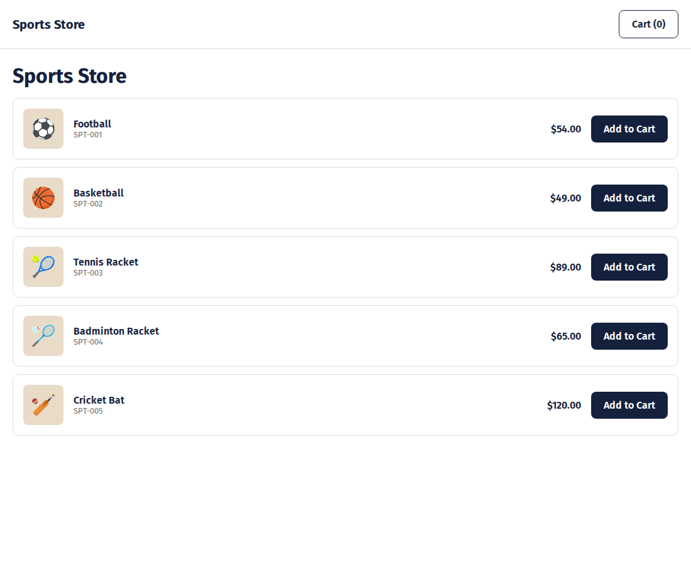
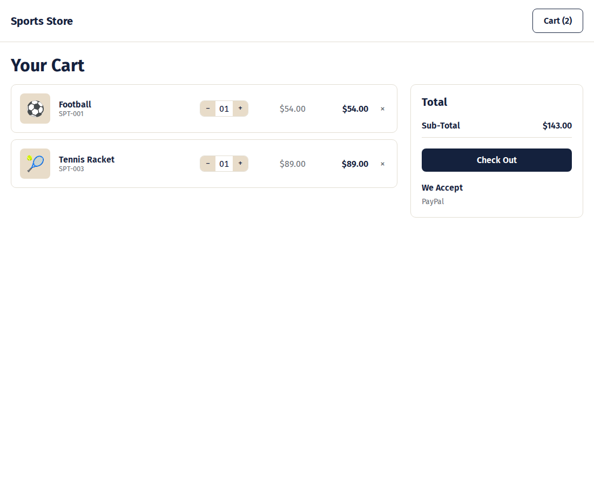
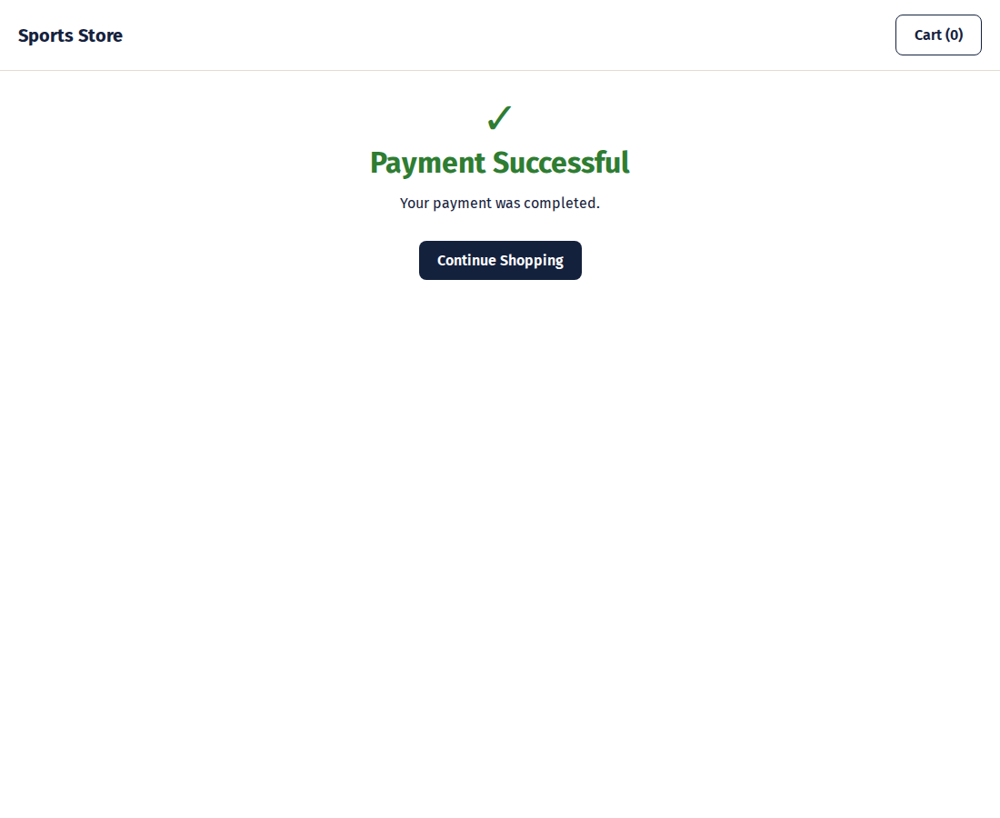
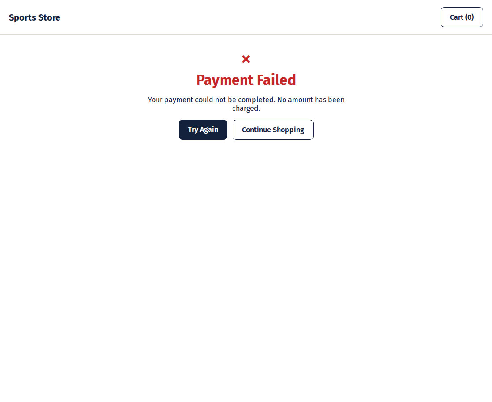

# Secure Payment Gateway

A full-stack demo that walks through the complete payment-processing flow: browse a small catalog, build a cart, and pay with **PayPal** (Sandbox), with the backend recomputing totals server-side and treating PayPal's own capture/webhook responses — not the client — as the source of truth for whether a payment succeeded.

Built as a learning project — see [`specs/goal-spec.md`](specs/goal-spec.md) for the full goals, scope, and glossary.

## Tech Stack

- **Frontend:** React + TypeScript (Vite), React Router, PayPal JS SDK (Smart Payment Buttons)
- **Backend:** NestJS (Node.js/TypeScript), Mongoose (MongoDB)
- **Payment Gateway:** PayPal Sandbox (Orders v2 API — create → capture, plus webhook confirmation)
- **Hosting (planned):** Vercel (frontend), Render (backend), MongoDB Atlas — see [`plans/03-deployment-plan.md`](plans/03-deployment-plan.md)

## Workflow

### 1. Browse the catalog
Five sports items, each with a light-brown thumbnail, name, product code, and price.



### 2. Review the cart
Adjust quantities, see line totals and a running Sub-Total, then Check Out.



### 3. Pay with PayPal
The Payment page renders PayPal's real Smart Payment Buttons (Sandbox), which hand off to PayPal's own hosted checkout — either logging into a PayPal account or paying as a guest with a card.

### 4. Success
Shown once the backend's `/payment/capture` call confirms PayPal actually captured the payment — not just that the buyer approved it.



### 5. Failure / Cancellation
Shown for a declined card or an abandoned checkout. No amount is charged in either case.



## Project Structure

```
backend/    NestJS API — items catalog, transactions, PayPal integration
frontend/   React SPA — catalog, cart, checkout, result pages
specs/      Living specs: goal, frontend, backend, API contract
plans/      Implementation roadmap and phase-by-phase plans
images/     Design mockup reference (e-commerce.png)
docs/       Screenshots used in this README
```

## Running Locally

### Prerequisites
- Node.js 20+
- Docker (for MongoDB) or a MongoDB instance
- A PayPal Sandbox app — see below

### 1. Start MongoDB
```bash
docker run -d --name spg-mongo -p 27017:27017 mongo:7
# or, if it already exists:
docker start spg-mongo
```

### 2. Backend
```bash
cd backend
npm install
cp .env.example .env   # then fill in your PayPal Sandbox credentials
npm run seed            # seeds the 5 catalog items
npm run start:dev       # http://localhost:3000
```

### 3. Frontend
```bash
cd frontend
npm install
cp .env.example .env.local   # then fill in VITE_PAYPAL_CLIENT_ID
npm run dev                   # http://localhost:5173
```

### 4. Get PayPal Sandbox credentials
1. Go to `developer.paypal.com` → **Apps & Credentials** (Sandbox toggle on) → **Create App**.
2. Copy the **Client ID** and **Secret** into `backend/.env` (`PAYPAL_CLIENT_ID`, `PAYPAL_CLIENT_SECRET`).
3. Copy the same **Client ID** into `frontend/.env.local` (`VITE_PAYPAL_CLIENT_ID`) — it's a public identifier, safe to duplicate.
4. (Optional, for webhook testing) Tunnel your backend with a tool like `cloudflared` or `ngrok`, register `<tunnel-url>/payment/webhook` as a Sandbox Webhook in the PayPal dashboard, and put the resulting Webhook ID in `backend/.env` (`PAYPAL_WEBHOOK_ID`).

## Documentation

| Doc | Contents |
|---|---|
| [`specs/goal-spec.md`](specs/goal-spec.md) | Goals, scope, success criteria, glossary |
| [`specs/frontend-spec.md`](specs/frontend-spec.md) | Pages, components, visual design, deployment |
| [`specs/backend-spec.md`](specs/backend-spec.md) | Architecture, data model, security, deployment |
| [`specs/api-contract.md`](specs/api-contract.md) | REST endpoints, request/response shapes |
| [`plans/`](plans) | Phase-by-phase implementation roadmap |
